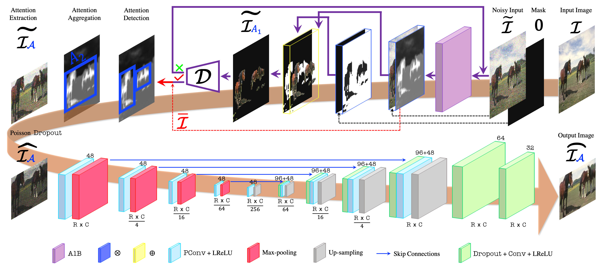
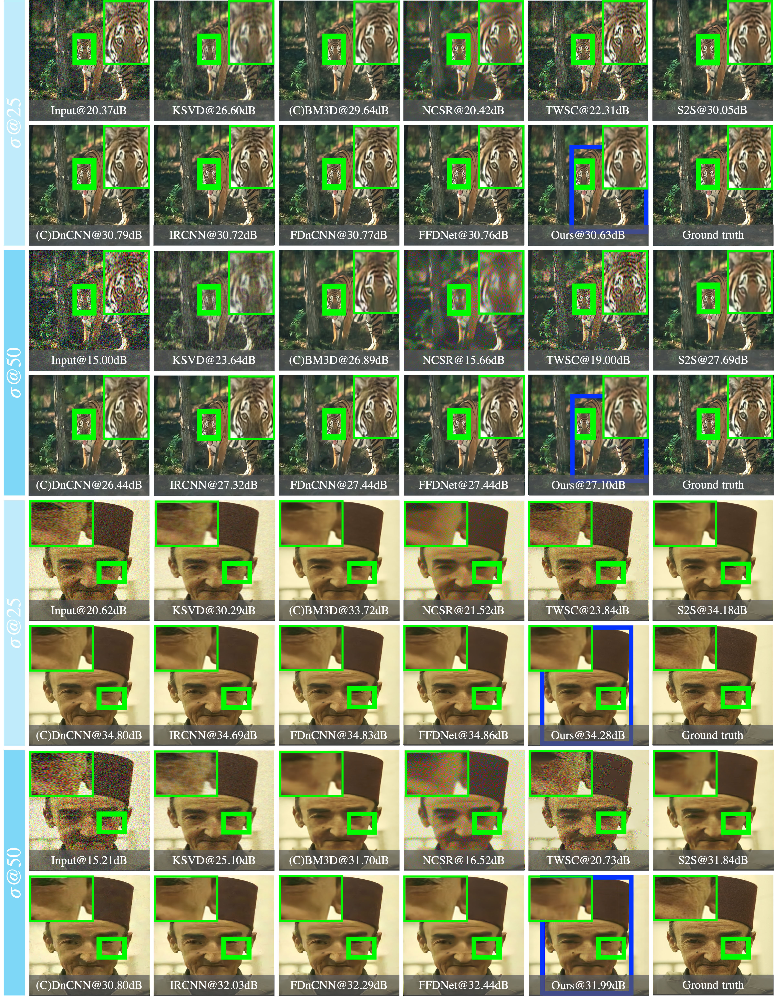
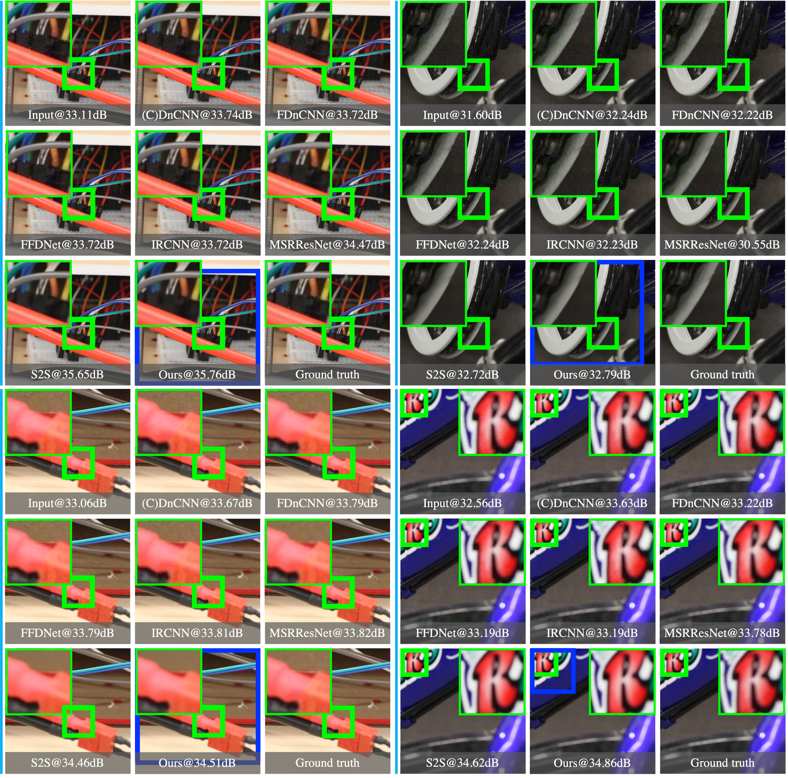
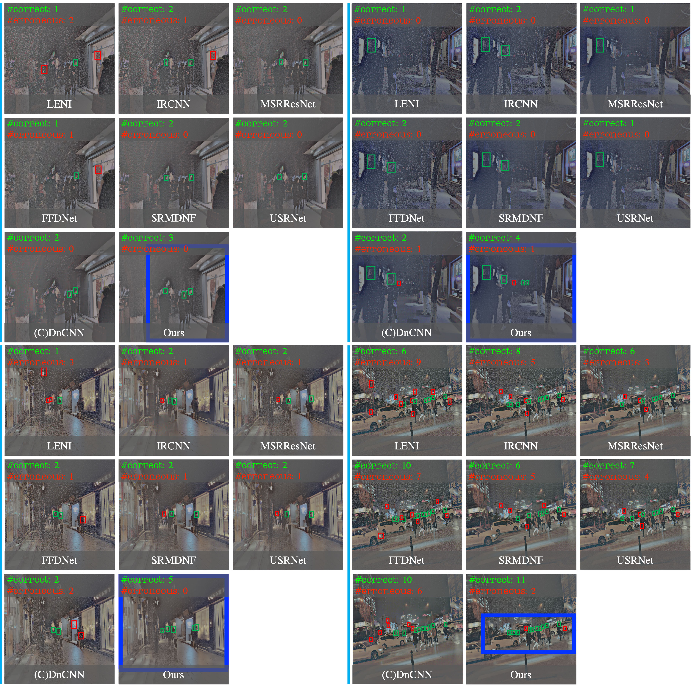

# IDEA-Net: Adaptive Dual Self-Attention Network for Single Image Denoising
...

## _Introduction_
This is an official implementation of our adapt**I**ve **D**ual s**E**lf-**A**ttention **Net**work (**IDEA-Net**).

IDEA-Net is an unsupervised single image denoiser, which performs on superiorly on AWGN and real-world image noises with a single end-to-end deep neural network, and contributes to the downstream task of face detection in low-light conditions.



For more details, please refer our [paper](https://arxiv.org/pdf/2101.03581.pdf).

## _Contents_
1. [Requirement](#requirement)
2. [Preparation](#preparation)
3. [Run](#run)
4. [Performance](#performance)

### _Requirement_
- TensorFlow == 1.14.0
- Python == 3.6
- CUDA == 10.0
- keras
- scikit-image
- scipy
- cv2

### _Preparation_
Clone the github repository. We will call the directory `$IDEA-Net_ROOT`
```Shell
  git https://github.com/zhemingzuo/IDEA-Net
  cd $IDEA-Net_ROOT
```

### _Run_
Run our IDEA-Net
```Shell
  cd $IDEA-Net_ROOT/src
```
and then run `denoise.py`.

### _Performance_
1. Removing AWGN Image Noise

Comparisons of AWGN denoising results in terms of PSNR on the [(C)BSD68](https://github.com/clausmichele/CBSD68-dataset) dataset with   valued as 25 and 50.  denotes the selected image region for comparison and  indicates the dual self-attention region drawn by IDEA-Net. Best viewed in zoomed mode.


2. Removing Real-World Image Noise

Comparisons of real-world image noise removal results with respect to PSNR on the [PolyU dataset](https://github.com/csjunxu/PolyU-Real-World-Noisy-Images-Dataset). \textcolor{green}{$\square$} denotes the selected image region for comparison and \textcolor{blue}{$\square$} indicates the dual self-attention region drawn by the proposed IDEA-Net. Best viewed in zoomed mode..


3. Downstream task on dark face detection

Performance comparisons of real-world dark/noisy face detection on the DARK FACE dataset \cite{9049390}. Light-Enhanced Noisy Image (LENI) is yielded by MSRCR \cite{jobson1997multiscale}. Detection results are generated by a RetinaNet \cite{lin2017focal} that pre-trained on the WIDER FACE dataset \cite{7780965}. \textcolor{green}{$\square$} and \textcolor{red}{$\square$} respectively represents the correct and erroneous detections. \textcolor{blue}{$\square$} indicates the dual self-attention region drawn by IDEA-Net. Best viewed in zoomed mode.
